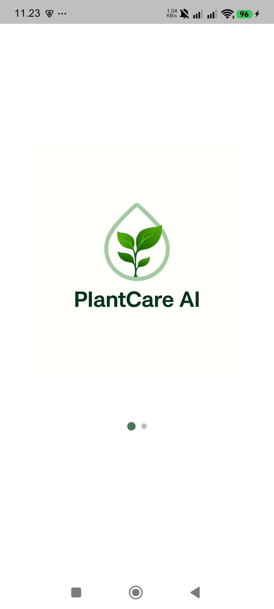
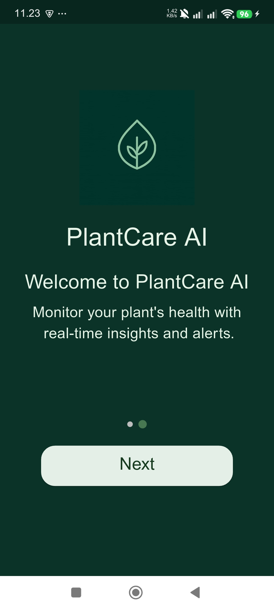
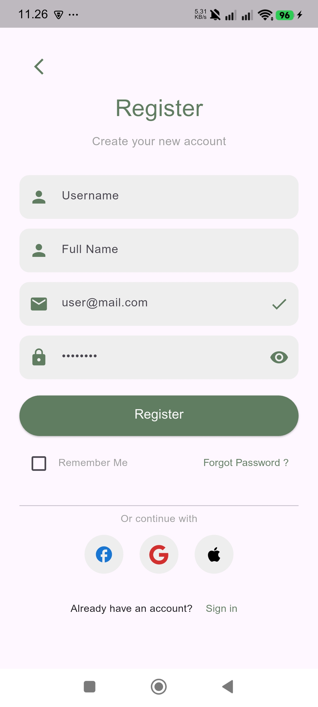
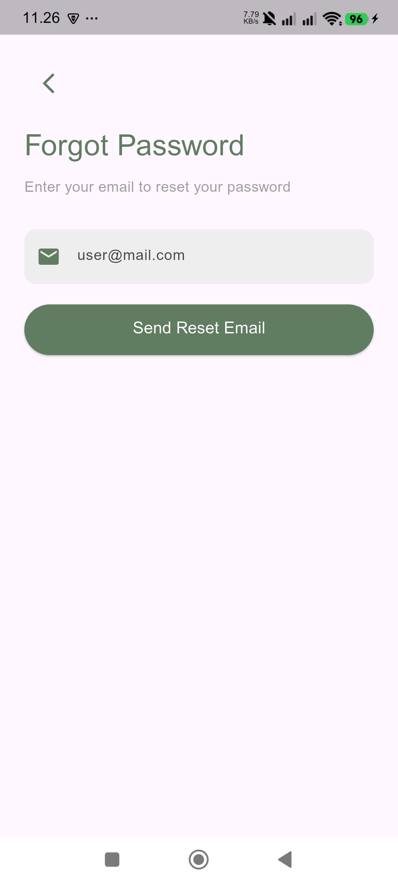
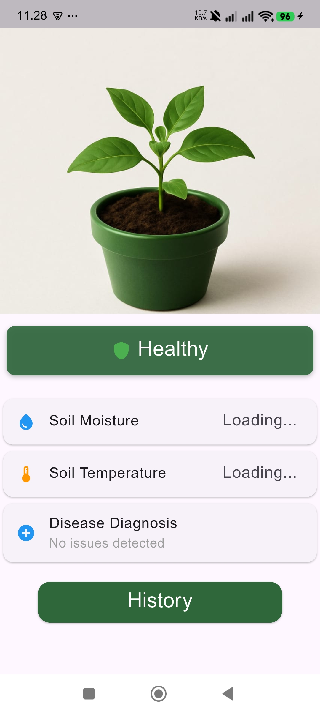
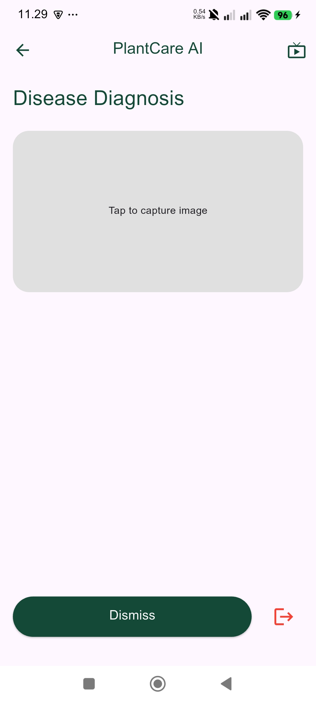
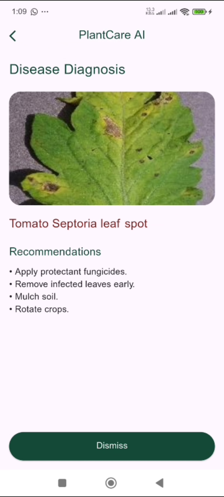
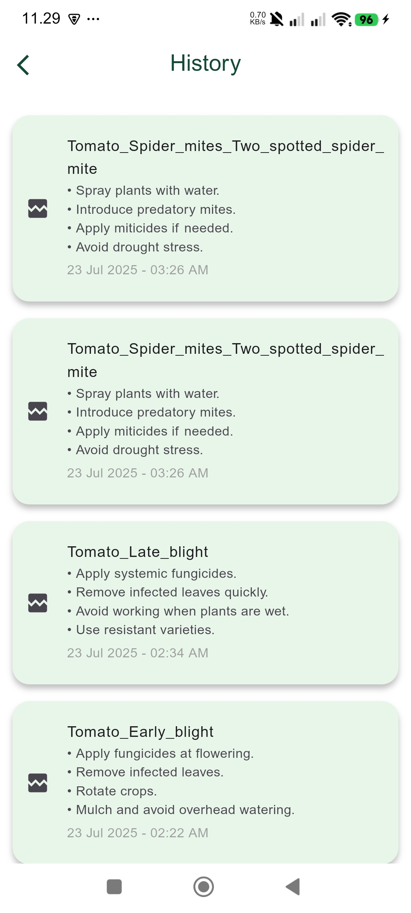

# 🩺 PlantCare AI

A Flutter-based mobile app prototype that detects plant diseases using image-based AI models deployed on Raspberry Pi. Users can capture leaf images to receive real-time disease diagnosis and health updates. The app features a nature-inspired UI and integrates Firebase for authentication and data storage.


---

## 🧭 Overview

PlantCare AI is a comprehensive mobile application that helps users monitor and maintain their plant's health through IoT sensors and AI-powered disease detection. The app provides real-time environmental data (soil moisture, temperature) and leverages machine learning to diagnose plant diseases from images captured via an integrated camera system.
Built with Flutter for cross-platform compatibility, PlantCare AI combines modern mobile development practices with cloud services and machine learning to deliver an intelligent gardening assistant.

---

## ✨ Key Features


🌡️ Real-Time Monitoring

Soil Moisture Tracking: Monitor soil moisture levels with visual feedback and alerts
Temperature Monitoring: Real-time soil temperature readings
Live Feed: Stream live video from your plant camera

🔬 AI-Powered Disease Detection

Image Capture: Capture plant images directly from the integrated camera
Disease Diagnosis: AI model analyzes images and identifies plant diseases
Recommendations: Receive actionable treatment recommendations for detected diseases
Detection History: View past diagnoses with timestamps and images

👤 User Management

Email/Password Authentication: Traditional registration and login
Social Authentication: Sign in with Google, Apple, or Facebook
Password Recovery: Forgot password functionality with email reset
Session Management: Secure session handling with automatic logout

📊 Data Persistence

Cloud Storage: Firestore integration for storing user predictions
History Tracking: Complete history of disease detections with images
User Profiles: Personalized experience with user data storage

---

## 🧠 AI Integration

The app uses a **deep learning model** trained on dermatology datasets to identify common skin diseases (like eczema, psoriasis, acne, etc.).  
The AI runs through a backend API or TensorFlow Lite (for offline prediction).

**Tech Stack for AI:**
- Python / TensorFlow  
- FastAPI / Flask (for API integration)  
- TFLite (for local on-device prediction)

---

## 🛠️ Tech Stack
- Frontend (Mobile App)
    Flutter: Cross-platform mobile framework (Dart)
    BLoC Pattern: State management with flutter_bloc
    Firebase Suite:
      Firebase Auth (Authentication)
      Cloud Firestore (Database)
      Firebase Core (SDK)


-  Backend/API
    Flask: Python-based REST API server
    Machine Learning: Plant disease detection model
    HTTP Server: Image capture and sensor data endpoints

- Third-Party Services
    Google Sign-In: OAuth authentication
    Apple Sign-In: iOS authentication
    Facebook Authentication: Social login
    WebView Flutter: Live camera feed streaming

- UI/UX Libraries
  Icons Plus: Extended icon sets
  Another Flushbar: Custom notifications
  Intl: Internationalization and date formatting
  Path Provider: File system access

---

## 📸 Screenshots












---

## 🚀 Getting Started

### 1. Clone the Repository
```bash
git clone https://github.com/soha131/Plantcare.git
```

### 2. Install Dependencies
```bash
flutter pub get
```

### 3. Run the App
```bash
flutter run
```

> Make sure your environment is set up with Flutter SDK.

---

## 🧩 Folder Structure

```
plantcare/
│
├── lib/
│   ├── main.dart                      # App entry point
│   ├── splash.dart                    # Onboarding screens
│   ├── login.dart                     # Login screen
│   ├── register.dart                  # Registration screen
│   ├── forget_password.dart           # Password recovery
│   ├── plant_health.dart              # Main dashboard
│   ├── disease_diagnosis.dart         # Disease detection screen
│   ├── history_screen.dart            # Detection history
│   ├── LiveFeedScreen.dart            # Camera live stream
│   │
│   ├── model/
│   │   ├── detect_cubit.dart          # Disease detection BLoC
│   │   ├── history_cubit.dart         # History BLoC
│   │   ├── history_state.dart         # History states
│   │   ├── model.dart                 # Data models
│   │   └── state.dart                 # Detection states
│   │
│   └── services/
│       └── api_service.dart           # API communication layer
│
├── assets/
│   ├── plantcare.png                  # App logo
│   ├── plant.jpg                      # Splash image
│   └── tree.jpg                       # Dashboard image
│
└── pubspec.yaml                       # Dependencies

---
```


## 📅 Future Enhancements

🌍 Multi-Plant Management - Support multiple plants with individual profiles and tracking dashboards.
📈 Growth Analytics - Visual charts showing plant health trends, growth patterns, and environmental history.
🔔 Smart Notifications - Automated alerts for watering schedules, abnormal sensor readings, and disease risks.
🗣️ Voice Assistant - Voice commands for hands-free monitoring and plant care guidance.
---

## 🤝 Contributing

Contributions are welcome!  
Please open an issue or submit a pull request to help improve the project.

---

## 📄 License

This project is licensed under the **MIT License** — feel free to use and modify it.

---
